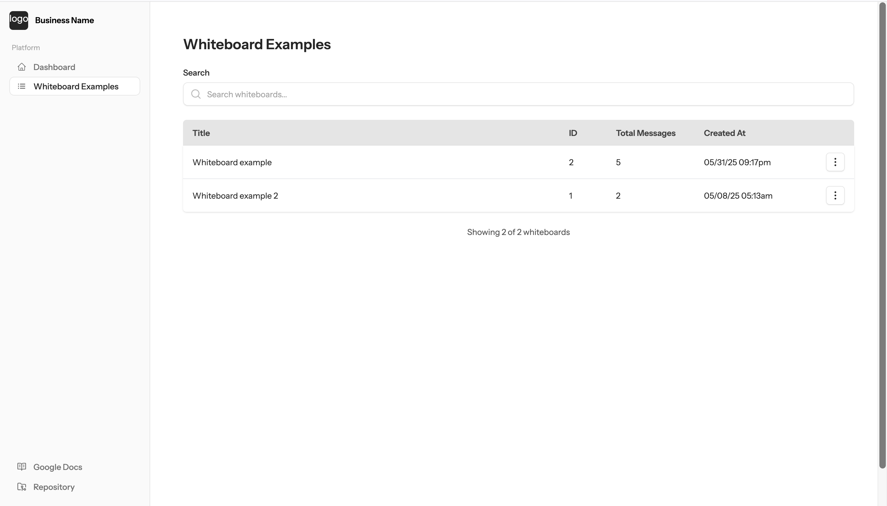

## 📊 Project 1: Custom Admin Panel

**Role**: Full-stack Developer  
**Tech Stack**: Laravel, Blade, MySQL, Tailwind CSS, FluxUI, Livewire, Alpine.js

### Overview
Designed and developed a custom admin panel for a business that needed tailored backend functionality. The goal was to streamline internal operations, reduce redundant manual tasks, and provide a clean interface for managing data and workflows.

### Features
- User and role management
- Custom data entry forms
- Real-time updates with Livewire
- Clean, responsive UI using FluxUI + Tailwind
- Role-based access controls

### Outcome
This panel dramatically simplified day-to-day tasks for the business, cutting down time spent on internal operations and reducing potential for error. The backend logic is structured for maintainability and scalability.
